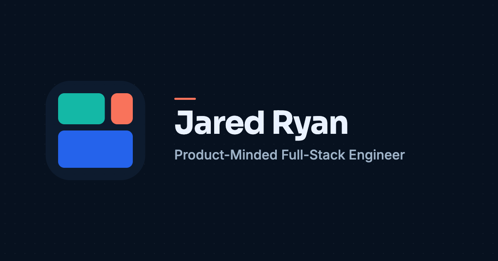

# Jared Ryan — Personal Portfolio

**Live: [jaredryan.netlify.app](https://jaredryan.netlify.app)**



A static-first portfolio built with Astro. It replaced an older client-side React SPA, on the theory that for a portfolio, the code is part of the pitch — a recruiter's browser (and any crawler) should get real HTML on the first response, not a blank `<div id="root">` waiting on JavaScript to decide what the page is.

## What's here

Four pages, no modals:

- **Dashboard** (`/`) — a three-card bento landing: an About/Hero card with a small typewriter ticker, an Experience preview, and a Projects preview.
- **Profile** (`/profile`) — the longer-form story: how I got here, in three chapters, plus what I bring to a team now.
- **Experience** (`/experience`) — full career history. A spine nav + detail panel on desktop, an accordion on mobile — never both at once, never hidden behind a scroll-jacked timeline.
- **Projects** (`/projects`) — a grid of shipped work, each with a screenshot carousel and, for three of them, a real playable game embedded on demand (the iframe doesn't exist in the DOM until you click Play, and it's torn down again on close).

Selected state lives in the URL — `?role=mantl#experience`, `?project=campfire#projects` — so a specific role or project is a shareable, bookmarkable, back-button-safe link, not something that resets on refresh.

## Design system: Coastal Systems + Spark

Calm, structured, and a little playful — not another generic blue SaaS theme. Deep navy and mist-blue surfaces carry the "systems" half; a coral accent (`Spark`) is used sparingly, for state and personality (selected rows, the typewriter cursor, hover accents) rather than decoration. Both a light and dark theme are fully tokenized in `src/styles/tokens.css`; nothing is hardcoded outside that file.

The build treats motion the same way: the only thing that animates on its own is the Hero's `Currently:` ticker. Everything else — the Experience accordion, the Projects carousel, card transitions — only moves in response to an actual click or keypress, and every animation collapses to near-zero duration under `prefers-reduced-motion`.

## Code quality

Not just "it looks right" — a few specific things this codebase is deliberate about:

- Reusable components, classes, and CSS tokens.
- Extensively tested for responsiveness, accessibility, and cross-browser compatibility
- Type-safe throughout — no `any` escape hatches.
- A real, intentionally scoped, test suite.

## Stack

- **[Astro](https://astro.build)** — static HTML by default; the few interactive bits (theme toggle, carousel, accordion, URL-state sync) are small, scoped `<script>` islands, not a client-side app shell.
- **TypeScript** throughout, including the client-side scripts.
- **[Lightning CSS](https://lightningcss.dev)** for CSS transforms/minification, targeting the browser list in `package.json` — chosen over PostCSS + esbuild's default minifier specifically because that combination was silently stripping vendor prefixes back out after adding them (see the comment in `astro.config.mjs`).
- **[Vitest](https://vitest.dev)** for unit tests (content-shape checks on `experience.ts`/`projects.ts`/`profile.ts`, and the URL-state helper).
- **[astro-icon](https://github.com/natemoo-re/astro-icon)** (Lucide + Simple Icons) — icons are inlined SVG at build time, not an icon font or a runtime icon-fetching library.
- **[@astrojs/sitemap](https://docs.astro.build/en/guides/integrations-guide/sitemap/)** for sitemap generation.

No client-side framework (React/Vue/etc.), no CSS framework, no analytics, no database, no forms. That's a deliberate scope, not an oversight — there's nothing on this site that needs any of them.

## Running it locally

Requires Node ≥22.13.0 (see `.nvmrc`).

```bash
npm install
npm run dev       # http://localhost:4321
npm run test      # vitest
npm run check     # astro check (types + template diagnostics)
npm run build     # check + test + production build to dist/
npm run preview   # serve the production build locally
```

## Deployment

Hosted on Netlify as a static site (`netlify.toml`: `npm run build` → publish `dist/`). Notable specifics, since a couple of them aren't Netlify's defaults:

- `netlify.toml` sets long-lived, immutable caching on `/_astro/*` — Astro/Vite content-hash those filenames, so there's no staleness risk in caching them forever.
- A baseline security header set (`X-Content-Type-Options`, `Referrer-Policy`, `Permissions-Policy`, `X-Frame-Options`) plus a `Content-Security-Policy-Report-Only` policy, staged before enforcement so it can be watched for false positives first. HSTS is left to Netlify, which already applies it.
- Deploy previews and branch deploys are automatically `noindex`ed by Netlify — only the production URL is ever meant to be crawled, and `robots.txt`/the sitemap only ever point at it.

## Accessibility

Not a bolt-on pass at the end — it's part of how the interactive pieces were built:

- Every interactive pattern (accordion, carousel, drawer, lightbox) is fully keyboard-operable: focus is trapped correctly in both the contact drawer and the screenshot lightbox (a real `Tab`-trap in each, not just an `aria-modal` attribute with nothing behind it), `Escape`/arrow keys work in the lightbox, and focus is moved intentionally after anchor/section navigation rather than left wherever the click happened.
- Visible focus states everywhere, via one shared `:focus-visible` treatment — nothing relies on the browser's outline alone, and nothing suppresses it without providing its own equivalent.
- Semantic HTML first: real `<button>`/`<nav>`/`<details>` elements doing what they already do, rather than a `<div>` with a click handler and an ARIA role bolted on — including not reaching for `role="tablist"`/`role="tab"` on the carousel's dot indicators just because they look tab-like, since they don't control any actual tabpanel (`aria-current` on a plain button group instead).
- The Hero's typewriter ticker only announces a complete phrase to screen readers once per cycle, not a stream of partial fragments as it types character-by-character — a separate throttled live region, not the same element the visible animation mutates every ~35ms.
- Contrast checked against WCAG AAA for font and WCAG AA for visual elements in both themes (see the note on Spark Coral's two shades in `tokens.css` — one for borders/backgrounds, a darker variant specifically for coral-as-text, since the base color doesn't clear 4.5:1 on its own).
- `prefers-reduced-motion` is honored globally, not per-component — every animation and transition in the codebase collapses to effectively instant for anyone with that preference set.

## Project layout

```text
src/
  components/    Astro components — one file per UI piece, scoped <style>
  data/           Content as typed data (experience.ts, projects.ts, profile.ts)
  layouts/        BaseLayout.astro — head, meta, theme script, footer
  pages/          Route entry points (index, profile, experience, projects, 404)
  styles/         tokens.css (design tokens) + global.css (resets, utilities)
  utils/          URL-state helper, focus management, motion helpers
```

Content (experience history, project descriptions, profile copy) lives in `src/data/*.ts` as plain typed objects — editing a role or a project description is a data change, not a template change.

## License

MIT — see [`LICENSE`](LICENSE). The code is here to be read; if something in it is useful to you, use it.
